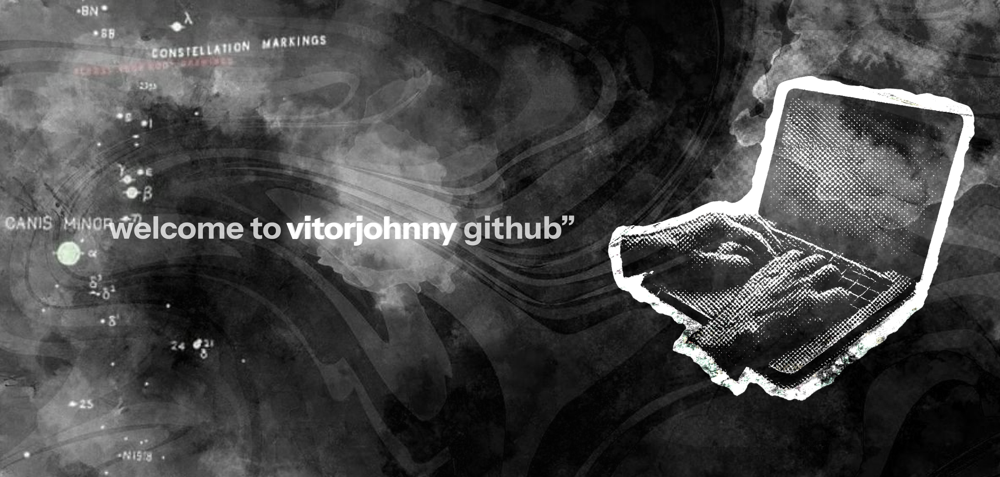

  

## 📊 GitHub Stats

  
  

  

 

## 💻 Technology Stack

  
  
  
  
  
  
  
  
  
  
  
  
  
  
  
  
  
  
  

 

  

<picture>
  <source media="(prefers-color-scheme: dark)" srcset="https://raw.githubusercontent.com/vitorjohnny/vitorjohnny/main/dist/github-contribution-grid-snake-dark.svg">
  
</picture>

  

